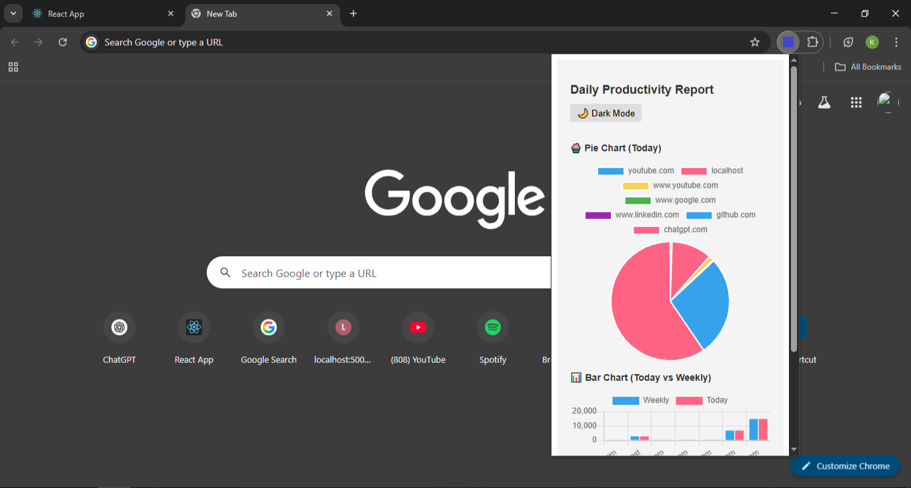
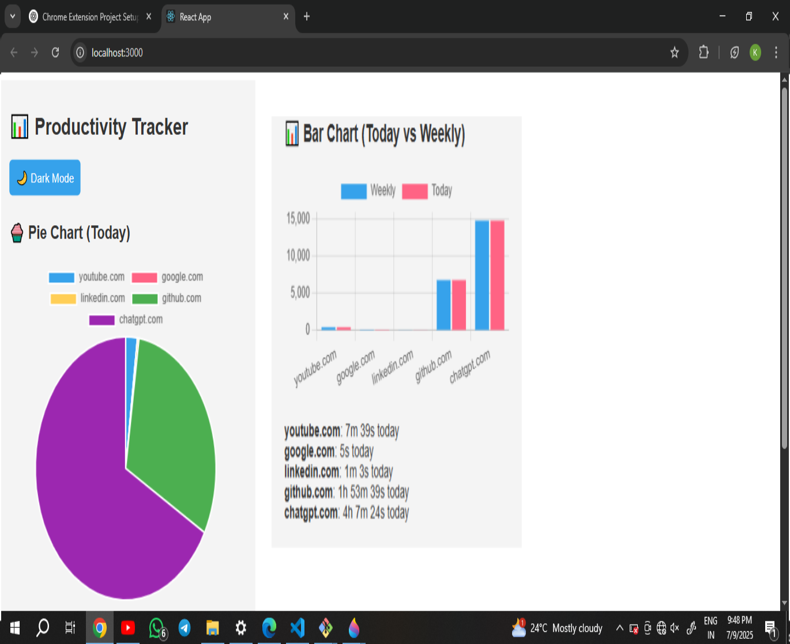

# 🧠 Productivity Tracker – Chrome Extension with Dashboard
```bash

"COMPANY" : CODTECH IT SOLUTIONS
"NAME" : SIYA NANDA
"INTERN ID" : CT06DF665
"DOMAIN" : MERN STACK WEB DEVELOPMENT
"DURATION" : 6 WEEKS
"MENTOR" : Neela Santhosh Kumar

```
---
A Chrome extension that **tracks the time you spend on different websites** throughout the day, stores it on a backend, and shows beautiful charts (Pie & Bar) on a dashboard using React and Chart.js.

---

## 📁 Project Structure
```bash
productivity-extension/
├── client/ # React dashboard
│ ├── public/ # Static assets (favicon, manifest, etc.)
│ ├── src/ # React components (App.js, charts, etc.)
│ ├── build/ # Production-ready files (after npm run build)
│ └── package.json # React dependencies
│
├── server/ # Node.js backend with Express + MongoDB
│ ├── routes/ # API endpoints (track user time)
│ └── server.js # Main backend file
│
├── extension/ # Chrome extension files
│ ├── background.js # Background tracking logic
│ ├── content.js # Page-level hostname capture
│ ├── index.html # Popup UI (chart embedded)
│ ├── popup.js # Chart rendering for extension
│ └── manifest.json # Chrome extension config

```
---

## ⚙️ Features

- ✅ Tracks time per hostname (e.g. `youtube.com`)
- ✅ Sends data from extension to backend
- ✅ Stores time data in MongoDB
- ✅ Real-time Pie & Bar charts using Chart.js
- ✅ Normalizes hostname (`www.` removed)
- ✅ Excludes `localhost` and shows `h m s` formatted durations
- ✅ Toggle dark/light mode
- ✅ Weekly vs Today breakdown
- ✅ React DevTools compatible

---

## 🧪 Technologies Used

| Layer         | Tech                          |
|--------------|-------------------------------|
| Frontend      | React.js, Chart.js            |
| Backend       | Node.js, Express.js, MongoDB  |
| Extension     | JavaScript, Chrome APIs       |
| Charts        | react-chartjs-2 + Chart.js    |

---

## 🚀 How to Run

### 🧩 1. Run Backend Server (Express + MongoDB)

```bash
cd server
npm install
node server.js
Make sure MongoDB is running locally or update your MongoDB URI in .env.

💻 2. Run React Frontend
bash
Copy
Edit
cd client
npm install
npm start
Visit the dashboard at http://localhost:3000

🏗️ 3. Build React App
bash
Copy
Edit
cd client
npm run build
This generates the optimized files in /client/build.

🔌 4. Set up Chrome Extension
Copy contents from client/build (like index.html, CSS, JS) into extension/ folder.

In Chrome:

Go to chrome://extensions

Turn on Developer Mode

Click Load Unpacked

Select the extension/ folder

Click the extension icon in your browser to view charts.
```
---

🙋‍♀️ Author
👩‍💻 siya nanda

📚 B.Tech CSE | Full-Stack Web Dev & DSA Learner

🌐 MERN | Java | MongoDB | Chrome Extensions | React Charts

---

## 📸 Screenshots

### 🔍 Chrome Extension


### 🔍 Extension in React App

